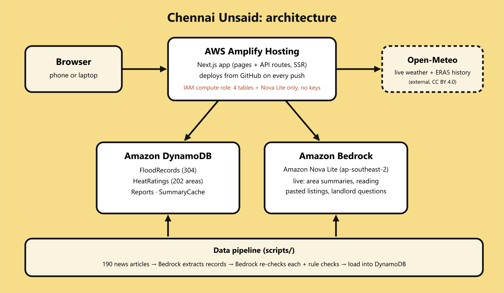

# Chennai Unsaid

**A place can look perfect. Until it rains.**

Flood history, heat and water for any Chennai area, before you rent or buy. Every flood mark links to the news report behind it.

- **Live:** https://main.d1v8v4f0epo1xy.amplifyapp.com
- **Track:** Heat and Water · Environmental Hacks, Bharat Builds Tour (WeMakeDevs × AWS), 8–11 Oct 2026
- **Demo video:** _add YouTube link_



## The problem

Chennai floods in the same localities every northeast monsoon. Residents know which streets go under. Someone signing a lease next month usually doesn't, because that history lives in scattered news articles and no listing mentions it. Heat works the same way: a dense area or a top floor can be much harder to live in, and nobody says so before you move.

## What it does

| Page | What you get |
|---|---|
| **Residents' Map** (`/spots`) | A community map: shade to rest, free drinking water, roads with no shade, waterlogged streets. Each pin has a photo, area and landmark, a one-line reason, the date seen and the name of who shared it (optional). New pins stay hidden until a photo check. Labelled **Demo**, **Community report** or **Verified** (3+ "still here" taps or checked by us). Search by area or landmark, filter by type, "Near me". |
| **Flood history** (home, water) | Pick any of 202 areas. See how high the water came in each year the news reported a flood, with the article behind each mark. "Now" shows the last 14 days of reports and live rain. |
| **Heat** (home, heat) | Live feels-like temperature, the hottest day and 40°C+ days of the past year, and what it means for daily life. Every number labelled live, past year or estimate. |
| **Check a property** (`/check`) | Area + floor + parking, or paste a broker's message. Claims are checked against the record. Verdict by a written rule, plus questions to ask before paying the advance. |
| **Compare two flats** (`/compare`) | Flooding, heat and water availability side by side, same measured indicators over the same period, source and date on every line, what's unknown, what to verify. |
| **Right now, live** (`/live`) | Rain in the last 24 hours and the next three days, plus live heat. Opens on whichever is hitting the area today. |
| **Will your water last?** (`/water`) | Supply cut planner: days your stored water lasts, the day it runs out, shortfall, tanker loads, what to do. |
| **Add your mark** | Anonymous resident reports: how high the water came, power cuts, dengue, water supply. |

The verdicts and comparisons are deterministic rules shown in the app. AI reads the news; it does not make the decision.

## AWS

| Service | Used for |
|---|---|
| **Amazon Bedrock** (Nova Lite, ap-southeast-2) | Extracting flood records from 190 news articles; a second pass re-checking every record and classifying articles; live area summaries (cached 24 h), reading pasted listings, landlord questions. |
| **Amazon DynamoDB** | `FloodRecords`, `HeatRatings`, `Reports`, `SummaryCache`, `Spots`. Every page reads live. |
| **Amazon S3** | Private bucket for Residents' Map photos. Never public: approved photos are served through the app, pending ones only to the reviewer. Location data is stripped from every photo. |
| **AWS Amplify Hosting** | Next.js SSR, deployed from `main` on every push. An IAM compute role scoped to the app's tables, the photo bucket and Nova Lite gives runtime access, so no keys exist in the code or environment. |

## Data

| Data | Source | Notes |
|---|---|---|
| Flood records (304, 82 areas) | DT Next, Deccan Herald, Citizen Matters, 2015–2026 | Extracted by Bedrock, re-checked by Bedrock and rules (look-backs, forecasts, complaints, feature pieces dropped). Links in `articles/urls.txt`; article text not committed. |
| Rain + heat history | [Open-Meteo](https://open-meteo.com) historical weather (ERA5, ~10 km grid), CC BY 4.0 | Same indicator and period for every area. |
| Live weather | Open-Meteo forecast API, CC BY 4.0 | Refreshed every 15 minutes. |
| Heat ratings (202 areas) | Team estimate from coast distance, tree cover, density | Labelled "estimate" in the app. |
| Resident reports | Users; seed reports written by the team | Seeds marked `seeded: true` and shown as "added by the team". |
| Residents' Map demo pins (8) | Written by the team | Marked "Demo" with dashed pins and no photo. Never counted as real reports. |
| Water norms | CPHEEO Manual on Water Supply (135 L/person/day), Sphere Handbook (15 L) | |

**Limits:** neighbourhood level, not street or plot level. No record does not mean no risk. Outdoor weather is not indoor temperature. No official water-supply or groundwater data is connected yet.

## Run it locally

```bash
npm install
aws login --profile chennai-unsaid   # or set APP_AWS_ACCESS_KEY_ID / APP_AWS_SECRET_ACCESS_KEY
npm run dev
```

`.env.local`:

```
APP_AWS_REGION=ap-southeast-2
BEDROCK_MODEL_ID=apac.amazon.nova-lite-v1:0
AWS_PROFILE=chennai-unsaid
```

### Data pipeline

```bash
npm run sweep            # find article links per locality
npm run fetch-articles   # download them into articles/*.txt (git-ignored)
npm run extract          # Bedrock → flood records
npm run audit            # Bedrock re-check + rules → data/flood-records.json
npm run load             # write to DynamoDB
```

## AI tools used

- **Claude Code** (Anthropic) for writing and debugging the code.
- **Amazon Bedrock, Nova Lite** inside the app (above).
- **[Image tool]** for the illustrations (auto driver, auto, wall, water, sky, icons).

## Credits

News outlets are linked, not copied. Weather data by Open-Meteo.com (CC BY 4.0). Fonts: Bungee, Rubik and Permanent Marker (Google Fonts, OFL).
